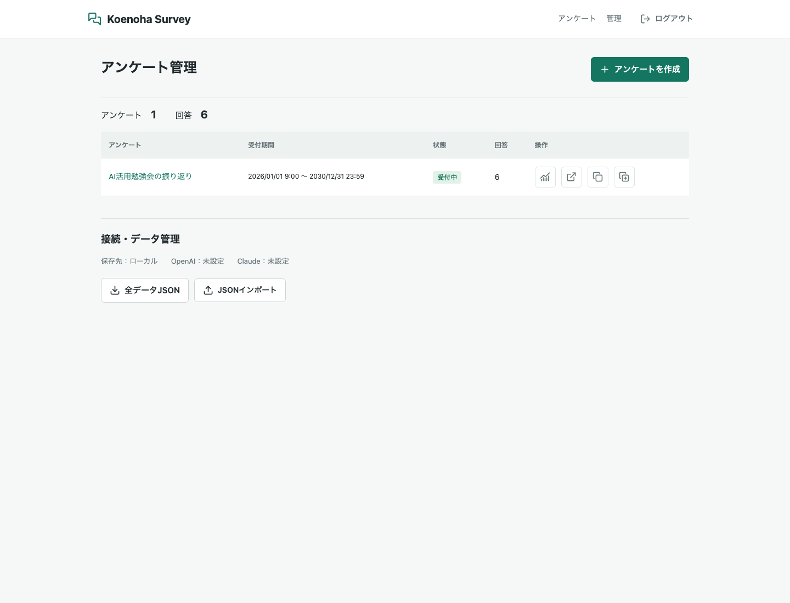
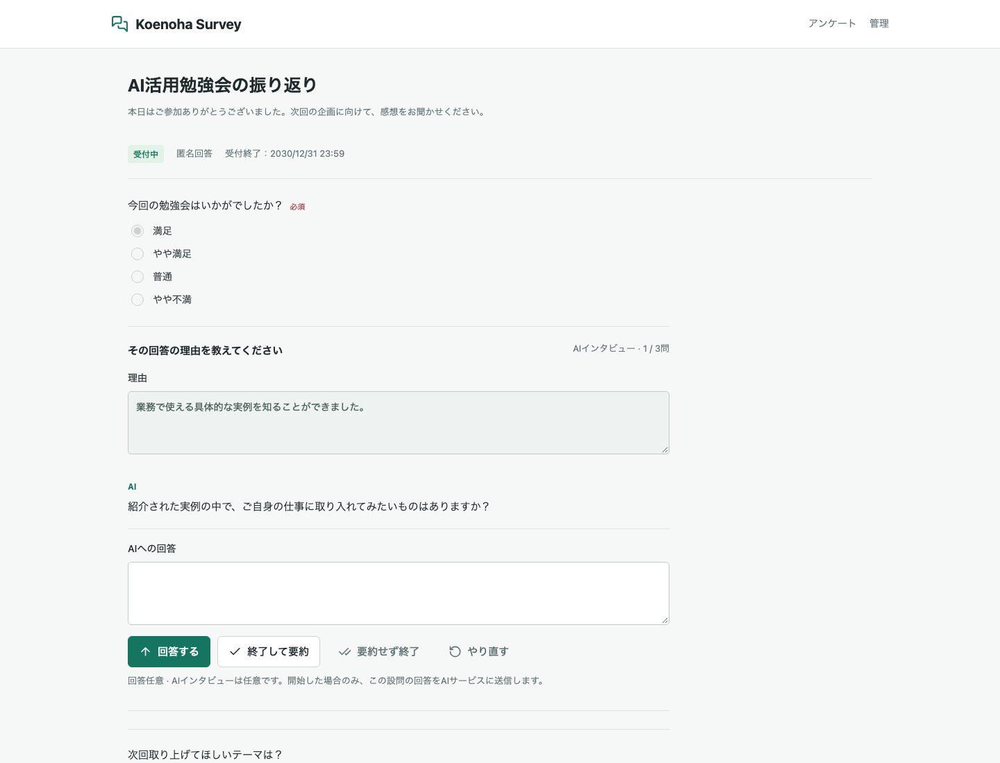
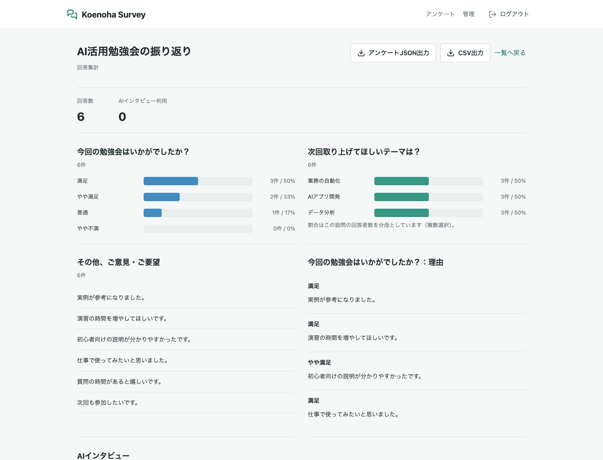

# Koenoha Survey

[MIT License](LICENSE)

勉強会・イベント・研修などの振り返りに使える、匿名アンケートシステムです。選択式や自由記述に加え、希望する回答者だけがAIとの対話で理由や体験を深掘りできます。

ブラウザでアンケートを作成・公開し、集計結果と会話履歴を確認できます。専用データベースは不要で、ローカルではJSONL、クラウドではGoogleスプレッドシートを使用します。



管理画面では、アンケートの受付状態・回答数を確認し、作成・複製・集計へ進めます。

## 主な機能

- パスワード認証付き管理画面。
- アンケートの作成・編集・複製、属性と設問の並べ替え。
- 下書き・公開・終了の切り替え、受付開始・終了日時の設定。
- 単一選択、複数選択、数値評価、短文、自由記述、独立したAIインタビュー設問。
- 通常設問への理由記述と任意のAI深掘りの追加。
- OpenAI / Claude対応。APIキーはサーバー側で管理。
- 設問別グラフ、理由・自由記述一覧、AI要約・会話履歴。
- アンケート別CSV・JSON出力、全データJSONバックアップとインポート。
- アンケート別のスプレッドシート指定と専用タブへの保存。

## スクリーンショット

以下は架空の勉強会・回答データを使った画面例です。AIの応答も撮影用のモックで、実際の参加者データや認証情報は含みません。

### 回答からAIとの対話へ

選択した回答と自由記述の理由をもとに、その場で任意の深掘りを行えます。



### 回答集計

選択肢の集計グラフと、回答に紐づく理由・自由記述を確認できます。



## ローカル起動

Node.js 22以上とnpmが必要です。

```sh
npm ci
npm run build
npm run setup
npm run dev
```

`npm run setup` は、既存ファイルがなければランダムな管理者パスワードと署名用シークレットを含む `.env` を生成します。既存ファイルは上書きしません。

- 回答者向けページ: http://localhost:5177/
- 管理画面: http://localhost:5177/admin

管理者パスワードは `.env` の `ADMIN_PASSWORD` です。共通の初期パスワードはありません。環境変数変更後はサーバーを再起動してください。

## 環境変数

設定例は [`.env.example`](.env.example) を参照してください。

| 変数 | 用途 |
| --- | --- |
| `PORT` | ローカルのポート。既定5177 |
| `ADMIN_PASSWORD` | 管理者パスワード。12文字以上 |
| `SESSION_SECRET` | 独立したランダムな署名用シークレット。32文字以上 |
| `STORAGE_DRIVER` | `local` または `sheets` |
| `OPENAI_API_KEY` | OpenAIのAPIキー |
| `OPENAI_MODEL` | OpenAIの既定モデル。コードの既定値は `gpt-5.4-nano` |
| `ANTHROPIC_API_KEY` | ClaudeのAPIキー |
| `ANTHROPIC_MODEL` | Claudeを使用する場合のモデルID |
| `GOOGLE_SPREADSHEET_ID` | 共通の管理用スプレッドシートID |
| `GOOGLE_SERVICE_ACCOUNT_EMAIL` | サービスアカウントJSONの `client_email` |
| `GOOGLE_PRIVATE_KEY` | 同じJSONの `private_key`。実改行または `\n` に対応 |
| `APP_ORIGIN` | 公開オリジン。例: `https://example.vercel.app`。末尾スラッシュなし |

AIのプロバイダーとモデルはアンケートごとに設定できます。モデル欄が空ならサーバーの既定値を使用します。利用可能なモデルIDを大文字・小文字も含め正確に指定してください。

`.env`、秘密鍵JSON、回答データはGitHubに登録しないでください。回答者にAPIキーを入力させる必要はありません。

## アンケートの運用

1. 管理画面にログインして「アンケートを作成」を選びます。
2. タイトル・説明・属性・設問を設定します。
3. 必要に応じてAI設定と保存先スプレッドシートIDを指定します。
4. 受付開始・終了日時を指定し、公開状態を「公開」にして保存します。
5. 回答URLを参加者に案内します。
6. 管理一覧から集計画面を開き、結果の確認・出力を行います。

公開には受付期間の指定が必要です。日時は画面ではブラウザのタイムゾーン、保存時はUTCで扱います。受付期間外や手動終了後は回答送信とAI対話を受け付けません。

### 複製と設問変更

管理一覧の「アンケートを複製」で設問・AI設定・保存先設定を引き継げます。新しいID、回答0件、下書き、受付期間未設定で作成され、元のデータは変更しません。同じファイルを指定していても保存タブは分かれます。

回答があるアンケートの設問構造や保存先は変更できません。タイトルや設問文の変更は過去の回答の表示にも影響するため、意味が変わる場合は複製してください。

## AIインタビュー

### 独立した設問

回答形式で「AIインタビュー」を選択します。回答者は自由記述だけで送信することも、「AIと対話して回答を深める（任意）」から対話することもできます。最初の記述を空欄にしてAIから質問してもらうことも可能です。

必須設問でもAIの利用自体は任意です。自由記述、または回答者の発言を含む終了済みの会話があれば回答できます。

### 通常設問に付随する深掘り

通常設問で「理由の自由記述と任意のAI深掘りを追加」を有効にします。理由の必須・任意と深掘り回数を設定できます。

回答者は「元の設問に回答 → 理由を自由記述 → 希望する場合だけAIと対話」の順に進みます。AI開始には元回答と理由が必要です。AIには対象設問・選択肢・元回答・理由を渡します。

元回答、理由、会話、要約は別々に保存し、選択肢の集計にAI要約を混ぜません。対話開始後は元回答と理由を固定し、「やり直す」で解除できます。

### 終了と保存

深掘り回数は1〜10回です。「終了して要約」「要約せず終了」で途中終了でき、回数上限でも要約に進みます。開始した対話は終了するか取り消してから、全体を送信してください。

アンケート末尾に全体の回答を参照する任意のAIインタビューを追加する設定もあります。新規作成時は無効です。

対話終了だけでは回答全体は保存されません。最後に送信完了画面を確認してください。再読み込みやタブを閉じると未送信の入力・会話は失われます。

## Googleスプレッドシートの準備

1. Google CloudプロジェクトでGoogle Sheets APIを有効にします。
2. サービスアカウントを作成し、JSON形式の鍵を取得します。
3. 自分のGoogleアカウントで専用スプレッドシートを作成します。
4. サービスアカウントのメールアドレスに「編集者」としてファイルを共有します。一般公開は不要です。
5. `STORAGE_DRIVER=sheets` とGoogle用環境変数を設定し、再起動します。
6. 管理画面で「保存用シートを初期化」を実行します。

スプレッドシートIDはURLの `/d/` と `/edit` の間です。`gid` はタブのIDなので指定しません。秘密鍵は `private_key_id` ではなく `private_key` を設定します。

アンケートの個別保存先IDが空欄なら共通ファイルを使用します。別ファイルを指定する場合も共有権限が必要です。共有済みファイル内のタブごとに設定し直す必要はありません。

### 保存するタブ

| タブ | 内容 |
| --- | --- |
| `surveys` | 共通ファイルに保存する定義・保存先設定 |
| `responses_<アンケートID>` | 復元用の完全な回答データ。JSONを複数セルに分割 |
| `answers_<アンケートID>` | CSVと同じ列構成の閲覧用の表 |

閲覧用の表は1回答1行です。「回答ID・回答日時」の後、設問表示順に「回答 → 理由 → AI要約 → 会話履歴」を並べます。該当しない補足列は追加しません。末尾は全体インタビューの要約・履歴です。

回答保存時に表を更新します。集計画面の「スプレッドシートに表を出力」でも再出力できます。手編集はアプリに反映されず、再出力で上書きされます。45000文字を超える会話セルは表示を省略しますが、完全な内容は保存用タブとJSON出力に残ります。

内部保存タブの編集・並べ替え・削除は避けてください。定義は追記された最新版を読み、回答はアンケートID・回答ID単位で重複排除します。既存の共通 `responses` タブがある場合も読み込みを継続します。

### 保存先の切り替え

ローカルデータは `data/` に保存されます。保存方式の変更だけでは移行されません。

切り替え前に全データJSONを出力し、Sheets設定・再起動・初期化後にインポートしてください。新規インポートしたアンケートは下書きになるため、設定を確認して公開します。

## 出力・バックアップ

- 集計画面のCSV: アンケート単位の表形式。UTF-8 BOM付き。
- 集計画面のアンケートJSON: 定義と全回答・理由・会話・要約。
- 管理画面の全データJSON: 全アンケートのバックアップ。
- 管理画面のJSONインポート: アンケート別・全体のどちらにも対応。

インポートは追加方式で、既存IDを上書きしません。同じIDで設問定義が異なる回答は拒否します。保存先IDも定義に含まれるため、別環境への復元時は保存先と共有権限を確認してください。

## GitHub・Vercelへの公開

このディレクトリをリポジトリのルートとしてGitHubへ登録し、Vercelでインポートします。登録前に秘密情報・回答データが含まれていないことを確認してください。

リポジトリの `vercel.json` に対応する設定:

| 設定 | 値 |
| --- | --- |
| Framework Preset | Other |
| Build Command | `npm run build` |
| Output Directory | `public` |

Vercel側に管理者認証・AI・Google接続の環境変数と、`STORAGE_DRIVER=sheets`、公開先に合わせた `APP_ORIGIN` を設定します。ローカルの `.env` は引き継がれません。環境変数変更後は再デプロイしてください。

Vercelではローカル保存を使用できません。ProductionとPreviewには別の保存先を使用してください。個別指定した保存先IDも分けます。同じスプレッドシートを指定した環境同士はデータを共有します。

公開後は管理者ログイン、回答送信、AI対話、Sheets保存、出力、受付終了後の制限を確認してください。

## 制限と注意事項

- 小規模利用向けです。CAPTCHA、高度なレート制限、ジョブキュー、自動リトライはありません。
- 受付期間内の大量アクセスやAI費用は期間設定だけでは防げません。プロバイダー側の利用状況も確認してください。
- AI処理後にも期間を再確認しますが、送信済みAIリクエストの費用は取り消せません。
- 匿名回答は本人確認や1人1回答を保証しません。不要な個人情報を収集しないでください。
- 1回答と全会話の保存上限はJSONで240000文字です。
- 保存・表更新失敗時は入力を保持したまま再送できます。保存済み原本がある場合も、同じ回答IDの再送は重複回答として集計しません。
- 管理者による同時編集は後から保存した内容が優先されます。

## テスト

```sh
npm test
```

認証、期間制限、入力検証、AI署名、集計、複製、出力・復元、Sheetsリクエストを検証します。自動テストは外部AI・Google接続を模擬し、課金APIや本番データにアクセスしません。

画面確認用の隔離サーバー:

```sh
node test/ui-fixture.js
```

`http://127.0.0.1:5178/survey/question-interview-check` でモックAIを使えます。メモリ内保存のため終了時にテストデータは消えます。Vercel上の動作確認はデプロイ後に別途実施してください。
